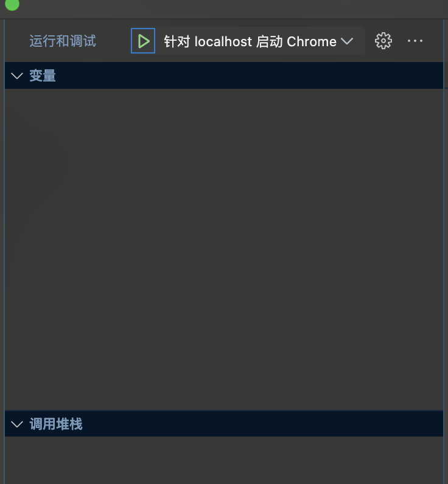

## vscode 调试

### 1..vscode/launch.json

```json
{
  // 使用 IntelliSense 了解相关属性。
  // 悬停以查看现有属性的描述。
  // 欲了解更多信息，请访问: https://go.microsoft.com/fwlink/?linkid=830387
  "version": "0.2.0",
  "configurations": [
    {
      "name": "针对 localhost 启动 Chrome",
      "type": "chrome",
      "request": "attach",
      "port": 9222,
      "userDataDir": false,
      "runtimeExecutable": "canary",
      "sourceMaps": true,
      "sourceMapPathOverrides": {
        "meteor://💻app/*": "${workspaceFolder}/*",
        "webpack:///./~/*": "${workspaceFolder}/node_modules/*",
        "webpack://?:*/*": "${workspaceFolder}/*"
      },
      "runtimeArgs": [
        // 无痕模式
        // "--incognito",
        // 自动打开开发者工具
        "--auto-open-devtools-for-tabs",
        "--user-data-dir=${workspaceFolder}/.vscode/chrome"
      ],
      "skipFiles": [
        "${workspaceFolder}/node_modules/**/*.js",
        "<node_internals>/**/*.js"
      ]
    }
  ]
}
```

### 2.终端监听 9222 端口

```shell
/Applications/Google\ Chrome.app/Contents/MacOS/Google\ Chrome --remote-debugging-port=9222 --user-data-dir=/Users/xxx/chrome-debugger
```

### 3.开启 debugger



### 4.启动本地服务

```shell
# http://localhost:3000/zh
pnpm dev
```

### 5.vscode 终端显示了类似 chrome 的 console.log

- 断点等功能也可以在 vscode 内调试了

## 部署

```shell
scp -r blog root@xxx:/home/blog/
ssh 'root@xxx'
cd /home/blog

docker-compose up -d
docker-compose down
```
